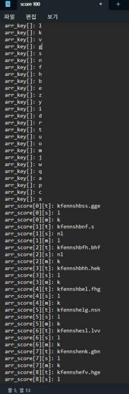

# Classcard-hack - classcard message hacking

This is a program that hacks scores using fetch requests.

## Usage

Input ggk's a in ggk.js  
Ex:

```js
a: function () {
 return [
 "x",
 "b",
 "u",
 "q",
 "y",
 "g",
 "a",
 "t",
 "h",
 "s",
 "z",
 "j",
 "p",
 "r",
 "k",
 "c",
 "f",
 "i",
 "n",
 "w",
 "m",
 "d",
 "o",
 "e",
 "l",
 "v",
 ];
},
```

Input cookie, set_idx, tid, class_idx, referer

```js
const cookie = "";
const set_idx = "";
const tid = "";
const class_idx = "";
const referer = ""; //classcard match uri
```

Run

```bash
node hack.js
```

## Mechanism - 2023/09/24

클래스카드의 매칭게임을 한 후 /Match/save로 보내지는 페이로드의 일부를 가져왔다.



이 페이로드의 arr_key와 arr_score 부분이 아마 점수와 관련된 데이터라고 추측한다. 그래서 Match 폴더에 존재하는 스크립트에서 arr_score가 어디에 정의되어있는지 확인했다.


다음과 같이 ‘arr_score’ 부분을 어떤 데이터가 덮어씌우는 구조로 되어있다. 이 데이터도 이 스크립트에서 검색을 해봤다.


```js
_0x380501[_0x5d2370(0x492)](_0x346eec, 0x0) _0x4adb0f['push'](ggk['d'](_0x380501[_0xe14a06(0x1eb, ? '7m8W')](_0x346eec,
-0x1), 0x0)) : _0x4adb0f['push'](ggk['d'](_0x346eec, 0x1));
```

이때 어떤 조건에 의해서 arr_score 배열에 ggk.d의 함수값을 추가하는 것으로 보이는데, 그럼 이 ggk 함수가 어떻게 구현되어있는지 확인하보자.


다음과 같이 ggk가 전역변수로 저장되어있다. 매칭 게임을 할때마다 ggk의 값이 변하는 것 같다.

```js
var ggk = {
  a: function () {
    return [
      "x",
      "b",
      "u",
      "q",
      "y",
      "g",
      "a",
      "t",
      "h",
      "s",
      "z",
      "j",
      "p",
      "r",
      "k",
      "c",
      "f",
      "i",
      "n",
      "w",
      "m",
      "d",
      "o",
      "e",
      "l",
      "v",
    ];
  },
  b: function () {
    return "basgggbxqy.buug";
  },
  c: function (a) {
    var r = "";
    var a = String(a);
    var k = this.a();
    for (var i = 0; i < a.length; i++) {
      var ii = a.charAt(i);
      if (ii == ".") {
        r += ".";
        continue;
      }
      ii = eval(ii);
      if (ii < k.length) {
        r += k[ii];
      }
    }
    return r;
  },
  d: function (a, b) {
    return { t: ggk.c(new Date().getTime() / 1000), s: ggk.c(a), m: ggk.c(b) };
  },
};
```

ggk 코드를 가져왔다. ggk.a에는 arr_key가, ggk.d는 t: ggk.c에 현재 초를 넣은 함수값, s에 는 첫 번째 파라메터를 ggk.c에 넣은 함수값, m는 두 번째 파라메터를 ggk.c에 넣은 것이다.  
ggk.c를 살펴보자면, 받은 파라메터를 각 자리의 문자를 ggk.a의 문자로 치환하는 것으로 볼 수 있다.
그럼 ggk.d가 어떻게 이용되는지 한번 알아보자.


단어 한 개를 매칭에 성공한 후의 arr_score의 값이다. 또한

```js
console.log(ggk["d"](100, 0x1));
```

를 실행한 결과는


s 값과 m값이 정확히 일치하는 것을 볼 수 있다.  
그러므로 ggk.d의 첫 번째 인자에는 이벤트로 인해서 얻게 된 점수가 들어가는 것을 확인 할 수 있다.  
그럼 우리는 ggk의 t를 조금 수정하고

```js
ggk["d"](100, 0x1))
```

를 누적시켜, arr_score 값을 생성해낼 수 있다.  
그래서 arr_score의 이차배열이 이벤트를 모두 모은 것, 이벤트는 t, s, m으로 구성되어있는
것임을 알 수 있다.


또한, 페이로드에 필요한 tid, set_idx, class_idx 모두 전역변수로 저장되어있는 것을 확인할 수 있다.  
그리고, activity는 코드 상에서 0x4로 고정되어있는 것을 조금 전의 사진에서 확인할 수 있다.  
그럼 한번 직접 해보자.

https://www.instagram.com/reel/CxkzvgeM5PQ/
